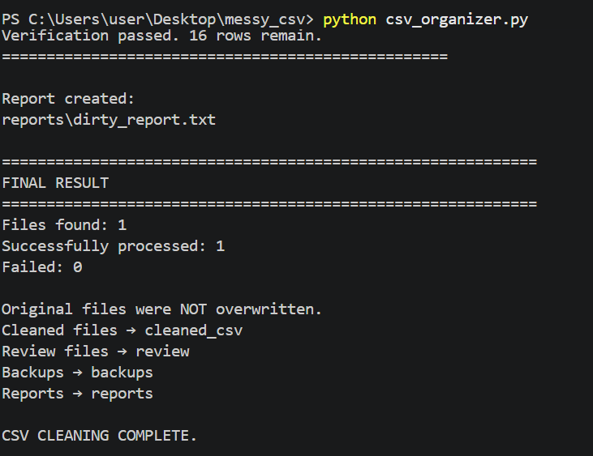

# CSV Data Cleaner & Validator

A Python automation tool for cleaning, validating, and organizing messy CSV files.

## Features

* Detects and removes duplicate rows
* Normalizes column names
* Cleans unnecessary whitespace
* Standardizes names
* Cleans and validates email addresses
* Cleans numeric values
* Standardizes dates
* Detects missing values
* Detects invalid email addresses
* Detects negative values
* Validates age values
* Sorts records by age
* Creates backups before saving results
* Creates review files for questionable data
* Generates detailed cleaning reports
* Verifies the cleaned CSV before completing the process
* Processes multiple CSV files automatically

## How It Works

The program scans a folder for CSV files and processes each file through a series of cleaning and validation steps.

Original files are never overwritten.

The program creates:

* `cleaned_csv/` - cleaned CSV files
* `review/` - questionable records requiring review
* `backups/` - backups of original files
* `reports/` - processing and data-quality reports

## Technologies

* Python
* Pandas
* Regular Expressions
* pathlib
* shutil

## Example

The included `dirty.csv` contains intentionally messy data such as:

* Missing values
* Duplicate records
* Invalid emails
* Negative prices
* Invalid ages
* Inconsistent capitalization
* Unnecessary spaces
* Inconsistent dates

The program cleans what can safely be cleaned and reports issues that require human review.

## Results

The program successfully processes the test CSV and produces:

* A cleaned CSV file
* A backup of the original data
* A review file for questionable records
* Detailed processing and data-quality reports
* Verification results confirming the cleaned output

### Example Execution



## Running the Program

Install the required packages:

```bash
pip install pandas send2trash
```

Run the program:

```bash
python csv_organizer.py
```

Place CSV files inside the `dirty_csv` folder before running the program.

## Project Structure

```text
messy_csv/
|-- csv_organizer.py
|-- dirty.csv
|-- dirty_csv/
|-- cleaned_csv/
|-- review/
|-- backups/
|-- reports/
|-- screenshot.png.png
`-- README.md
```
